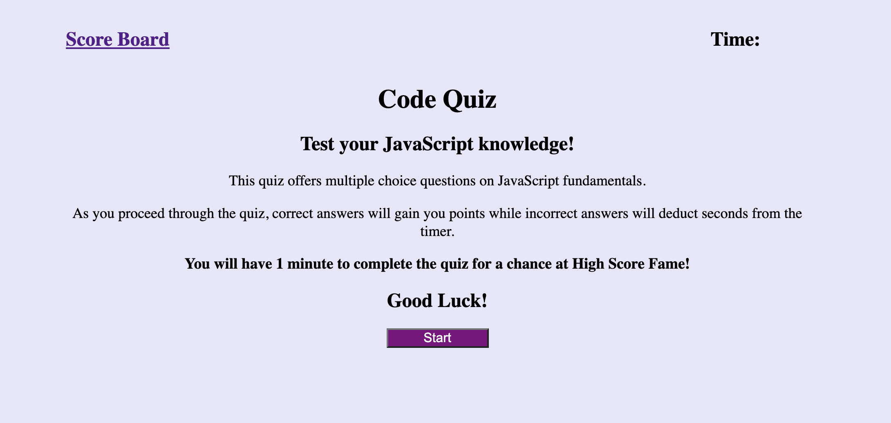
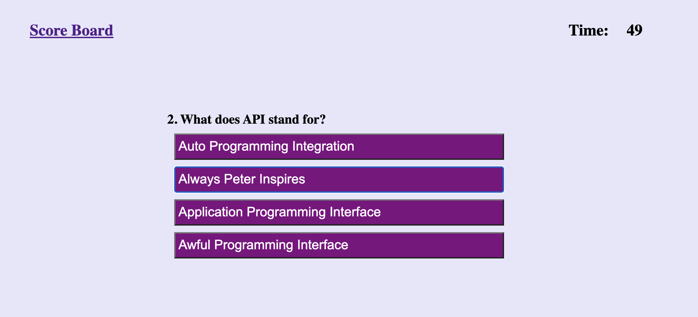
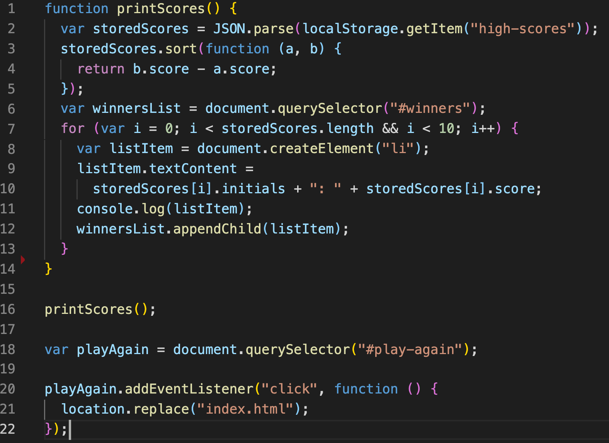

# Code-Quiz

# Description

The purpose of this project was to create a timed quiz on JavaScript fundamentals.

The User begins on main page which offers them the option to Start the game or view the Scoreboard. The Scoreboard will direct them to a new page where the top 10 scores are displayed while the Start button will start the timer and begin the multiple choice quiz.

During the quiz, the User is offered four options. Depending on their chosen answer, a Correct or Incorrect button will flash on the screen momentarily before displaying the next question. An Incorrect Answer will deduct 5 seconds from the remaining Time.

At the end of the game the User Score will be the seconds remaining on the Timer. The User will be prompted to enter their Initials which will be stored in Local Storage before moving to the Scoreboard which displays the Top 10 in descending order.

## Try It Yourself!

Take the [Code Quiz](https://jkelly101.github.io/Code-Quiz/) for your own chance at High Score Fame!

## License

- [License]https://choosealicense.com/licenses/mit/

## Questions

If you have any questions, please contact me at <jenLkelly@gmail.com>.  
You can also visit my [Github Page](https://github.com/jkelly101).
